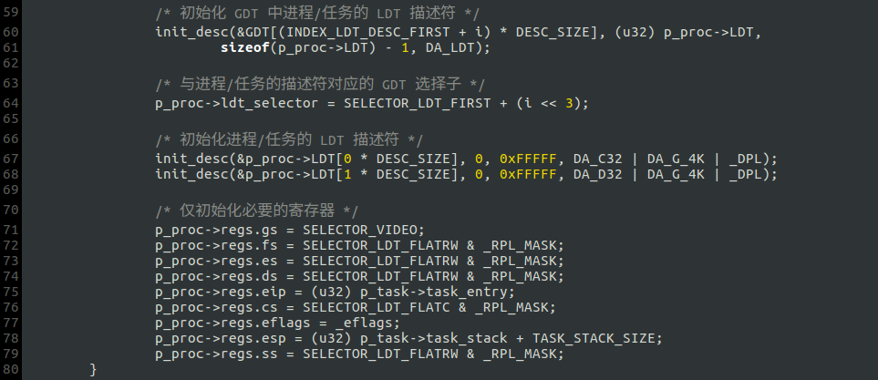
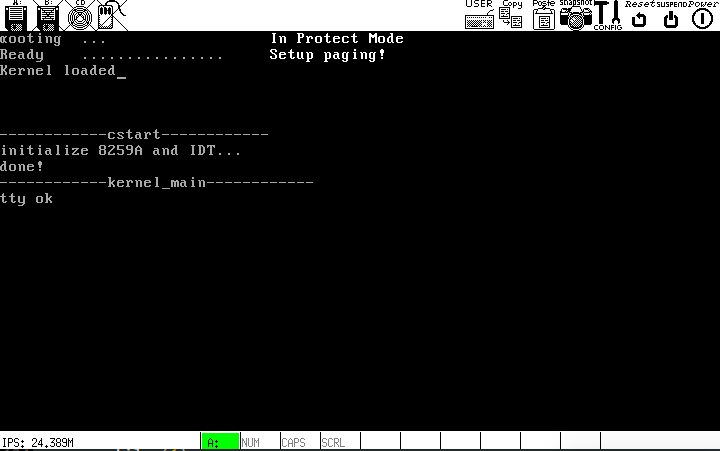

# c. 区分用户进程和任务
将终端任务`Task_tty`放在 ring0, 三个用户进程放在 ring3.

## 步骤
### 1. 修改/添加变量定义(include/sysconst.h)

### 2. 在所有用到`NR_TASKS`的地方进行修改:
- `include/proc.h`

用户进程和任务还是同一放到`proc_table`里.

- `kernel/main.c` 初始化进程表时区分用户进程和任务

- `kernel/clock.c` 进程调度相关

### 3. 将`Task_tty()`函数单独放进`kernel/tty.c`

## 运行结果
