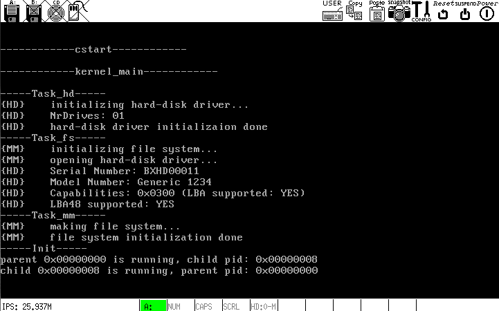

# 解决`fork()`的难题

## 缘由
`fork()`生成的子进程的代码段和数据段的线性基地址不为0，若有符号(全局变量和函数)X，在子进程和内核中访问X，则两次访问的"X"不在同一个地址上. 如果X是函数，不会有任何异常；如果X的全局变量，则对X的写操作将不会在子进程空间和内核空间内同步. 即：若fork前，X = x0; fork后，在内核中将X改为x1，若子进程直接读取X，读取到的值是x0. 因为`p_current_proc`是全局变量，在时钟中断的调度下内核空间中的`p_current_proc`被修改，则子进程无法实时读取`p_current_proc`的正确值，子进程只能获得fork前一时刻的`p_current_proc`.

## 解决
将那些访问全局变量的函数实现为系统调用，从而在内核空间下访问这些全局变量. 这样的设计有其合理处，因为全局变量可被认为是系统数据，只有通过系统调用才能读写之. 目前现将`getpid()`和`getppid()`实现为系统调用.

## 2017/10/21 修改:
- 取消用户进程(ring3)的I/O权限，将`printf`内部实现为系统调用`printk`;
- 既然`getpid`为系统调用，`excep_handler`就不应调用之，因为`excep_handler`同样允许在内核态;
- 调整了中断例程内*开中断*和*关中断*的位置.
